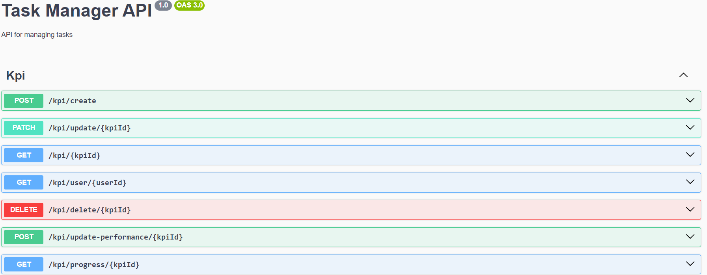

## Task Manager 
it is based on nest js project, it will be integrated all feature with client mobile apps and web app

### Screenshot

url_path = http://localhost:3000/

### Routes
1. Auth
   - Login: POST `url_path/auth/login`
   - Refresh: POST `url_path/auth/refresh`

2. User
   - Register: POST `url_path/users/register`
   - Users: POST `url_path/users/users`
   - User-Teams: GET `url_path/users/:userId/teams`
   - Profile: GET `url_path/users/:userId/profile`

3. Tasks
   - Tasks: POST `url_path/tasks`
   - Tasks: GET `url_path/tasks`
   - Tasks: DELETE `url_path/tasks`
   - User Tasks: GET `url_path/tasks/user/:userId`
   - User Completed Tasks: GET `url_path/tasks/user/completedtask/:userId`
   - User Total Completed Tasks: GET `url_path/tasks/totalcompletedtask/:userId`
   - User Teams: POST `url_path/tasks/team`
   - User Team: GET `url_path/tasks/team/:teamId`
   - Task Owner: GET `url_path/tasks/owner/:ownerId`
   - Single Task: GET `url_path/tasks/:id`
   - Update Task: PATCH `url_path/tasks/:id`
   - Delete Task: DELETE `url_path/tasks/:id`
   - Sorted Task: GET `url_path/tasks/sorted/:order` -> ASC, DSC
   - Filter Task: GET `url_path/tasks/filter/:priority` -> high, medium, low
   - Filter Sorted Task: GET `url_path/tasks/:priority/sort/:order/page/:page/limit/:limit`
   - Search Task: GET `url_path/tasks/search/:query/page/:page/limit/:limit`
   - Tag Task: `url_path/tasks/tags/:tag`

4. Teams
   - Teams: POST `url_path/teams`
   - Teams: GET `url_path/teams`
   - Single Teams: GET `url_path/teams/:teamId`
   - Add Member Team: PUT `url_path/teams/:teamId/members`
   - Add Task in Team: PUT `url_path/teams/:teamId/tasks/:taskId`
   - Add Member in Team: PUT `url_path/teams/:teamId/users/:userId`
   - Add Role in Team: PUT `url_path/teams/:teamId/users/:userId/role/:role`
   - Delete Team: DELETE `url_path/teams/:id` 